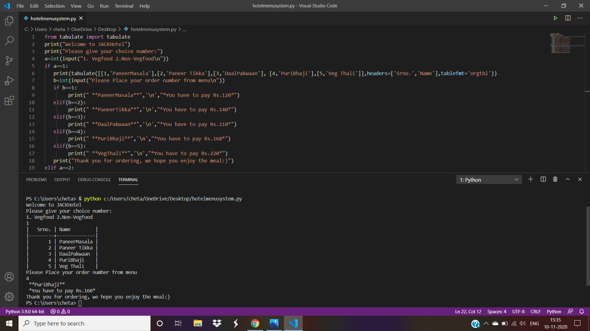

# Hotel-Menu-System
Python Project

Aim : Perform a Python Program to choosing a food from Hotel menu using Python Software

Software : Python 3.7.4

Theory :
python-tabulate
Pretty-print tabular data in Python, a library and a command-line utility.
The main use cases of the library are :printing small
tables without hassle: just one function call, 
formatting is guided by the data itself authoring tabular data for lightweight plain-text markup: multiple output formats suitable for further editing or transformation
readable presentation of mixed textual and numeric data: smart column alignment, configurable number formatting, alignment by a decimal point
 

Installation Tabulate
To install the Python library and the command line utility

run:
# pip install tabulate

The command line utility will be installed as tabulate to bin on Linux (e.g. /usr/bin); or as tabulate.exe to Scripts in your Python installation on Windows (e.g.
C:\Python27\Scripts\tabulate.exe).
You may consider installing the library only for the current user:
pip install --user

In this case the command line utility will be installed to
~/.local/bin/tabulate on Linux and to
%APPDATA%\Python\Scripts\tabulate.exe on Windows.
 
Procedure :
1)	Install the latest version of python
2)	Import/Download this package and library
3)	write a source code in the new file
4)	save and execute the file
5)	enter the value which you want

output 1:

output 2:

Conclusion :
The Python Tabulate and If else statement In the Python programming have been studied Successfully.
